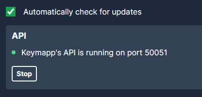

# zsa-keymapp-talon

Control your ZSA keyboard (Moonlander / Voyager / Ergodox) using the [Keymapp](https://blog.zsa.io/keymapp/) API (Protobuf) in Talon (https://talon.wiki/)

👞 Best enjoyed with a foot pedal - supported by talon https://talon.wiki/quickstart/hardware/#foot-pedals

# Installation

1. Clone this repo into your talon user folder (`~/AppData/Roaming/talon/user`)

2. Install grpc into your talon virtual environment

```shell
cd ~/AppData/Roaming/talon/venv/3.13/Scripts
pip install grpcio grpcio-tools mypy-protobuf
```

# Usage

Ensure your Keymapp API is enabled in the application,



Trigger the layer change by using the `set_keymapp_layer` function in a .talon file.

### Example

Switch between layer 1 and 2 using a foot pedal:

```
deck(pedal_middle:down): user.set_keymapp_layer(1)
deck(pedal_middle:up): user.set_keymapp_layer(0)
```

# Notes

See also https://github.com/ohare93/zsa-keymapp-python/ for a non Talon implementation

## Generating the grpc files

No need to do this, since the generated files are included in this repo. But for the sake of documentation here is how they were generated:

```shell
poetry run python -m grpc.tools.protoc -I. --proto_path . --python_out . --mypy_out . --grpc_python_out . ./protos/*.proto
```

A manual edit was made in the generated `keymapp_pb2_grpc.py` file. Adding `from .` to the import statement of the other generated file on line 6.
